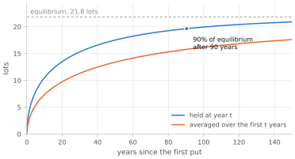
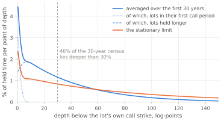

# The Inventory {#sec:inventory}

Lots arrive at a known rate and stay for a known average time. How much stock does the operator end up holding? **Little's law** answers it, and asks almost nothing of the strategy in return; the detour on it states the law and says where it comes from.

The section puts the law to work three times: once to **count** the lots standing in inventory, once to read the same count over a **window** of finite length instead of at equilibrium, and once to **weight** each lot by what it accrues rather than counting it as one. All three are the same identity, and each asks something slightly different of it, so the hypotheses are picked up where they are used rather than all at once here.

## Detour: Little's law

> Take any system that things enter, spend time in, and leave: customers in a shop, patients in a hospital, stock lots in a wheel. Write λ for the rate at which items arrive, W for the average time one spends inside, and L for the average number inside. **Little's law** says
>
> L  =  λ · W
>
> Forty customers an hour, each staying half an hour, keep twenty in the shop on average. The reason is bookkeeping: summing the number inside over every moment, and summing every item's stay, count the same item-hours two ways.
>
> So the law asks for almost nothing. [Little's 1961 paper](#ref:little-1961) calls its results "remarkably free of specific assumptions about arrival and service distributions, number of channels, queue discipline" — how items arrive, how long each takes, how many are served at once, in what order they leave — and it needs no independence either. Any boundary serves as "the system", so long as L, λ and W all use the same one, and that is what lets a warehouse of stock be treated as a queue. It is a conservation identity, not a model.
>
> [The same paper](#ref:little-1961) does make one requirement — that queue length, waits and arrivals are all strictly stationary — and concedes it is "probably not the weakest requirement possible". The assumption-free forms came later — [Stidham's](#ref:stidham-1974) sample-path version, needing only that the arrival rate and the average stay exist, and [Little's finite-window form](#ref:little-2011), needing nothing, which this section uses below. [Ross's *Introduction to Probability Models*](#ref:ross-probability-models) proves the standard statement.

## Applying it

Arrivals are one lot per put assigned, at rate

λ  =  p\* / T  =  0.20 / (1/52)  =  **10.4 lots per year**    {#eq:lambda}

and each stays E[W] = 2.10 years by [eq:holding](#eq:holding). With the mean inventory E[I] as L, the law gives

E[I]  =  λ · E[W]  =  10.4 × 2.10  =  **21.8 lots**    {#eq:little}

Twenty-two lots. The strategy was described at the outset as one that sells puts and occasionally takes assignment; at equilibrium it is a strategy that owns twenty-two lots of stock and sells puts on the side.

The wheel needs every freedom the **Little's law** detour listed. Its lots ride one price path, so they are called away in batches when the price recovers, and the fall that assigns a new lot pushes the held ones deeper; they leave in order of depth, not of arrival; and their stays follow nothing tidy — half gone within eight weeks, the mean over two years. The average survives all of it exactly, which is why this identity, rather than any distributional argument, is the load-bearing step of the article.

There is also a way to say the answer with no clock in it at all. Count time in *arrivals* rather than in years, and the law reads: **while you hold one lot, about twenty-two more are assigned.** Same number, nothing for the reader to multiply, and no rate to be quoted per year.

## The equilibrium the unconstrained operator will never see

Twenty-two lots is where the system settles. It is not where an operator will find it at any point in a trading career.

The wheel starts empty, and filling it is slow — because filling it requires the *tail* of the holding-time distribution to populate, and that tail is measured in decades. Let I(t) be the number of lots held t years after the start, and S(u) the chance that a lot is still held u years after its assignment — the survival sequence of [eq:survival](#eq:survival) read against a lot's age in years, so S(u) = S_j while j·τ_c ≤ u < (j+1)·τ_c. At time t, the lots aged between u and u + du were assigned at rate λ, so there are λ·du of them on average, and a fraction S(u) of those are still held. Adding up every age from zero to t:

E[I(t)]  =  λ · ∫₀^t S(u) du    {#eq:little-finite}

Averages add however dependent the things averaged are, so lots sharing one price path do the count no harm. And although assignments arrive weekly rather than as a steady flow, S(u) is flat within each call period, so counting week by week gives the same total at every call date. As t grows, the integral becomes the whole area under the survival curve, which is E[W] by [eq:holding](#eq:holding), so the formula settles back into the equilibrium law, [eq:little](#eq:little). Two readings of that trajectory matter, and figure [fig:inventory-approach](#fig:inventory-approach) draws both:

{#fig:inventory-approach}

The upper curve is what the operator is holding when year t arrives. The lower is the average across the whole period, and it is the one the rest of Part II reports, because a return earned over a window has to be measured against the capital committed *throughout* that window rather than at its end. Every horizon-indexed figure from [the returns section](#sec:returns) onward is an average of the second kind, and the distinction is worth carrying: at thirty years the operator holds 15.4 lots against an average of 11.4, a third more.

The lower curve is Little's law read over the window: divide the window's average inventory by the arrival rate, and what comes back is the time a lot spends inside it — 0.52 years over a five-year window, 0.71 over ten, and **1.10 over thirty, against a full life of 2.10.** A lot assigned in year 28 can spend at most two years in the window, so the window sees about half of each lot and holds about half the equilibrium inventory. [Little's finite-window form](#ref:little-2011) covers exactly this case — a window that starts empty and closes with lots still held.

What the window law does not say is how 11.4 relates to 21.8. That is a question of how fast the system fills, which the rest of this subsection takes up.

Reaching 90% of the equilibrium level takes **90 years** — the horizon at which the integral in [eq:little-finite](#eq:little-finite) reaches nine tenths of E[W], and marked on the upper curve of figure [fig:inventory-approach](#fig:inventory-approach). An operator running this strategy for a full career holds about **seven tenths** of where it is heading, and the holding is still rising.

That 90% is a convention: nine tenths of an asymptote is a threshold chosen by whoever is writing, not a date on which anything happens. An operator with a finite account gets a real threshold instead — the date its ceiling starts refusing puts — and [the constrained section](#sec:constrained) computes it, together with the share of the strategy such an account actually runs.

The 21.82 is *the* answer a queueing textbook would give, and it remains the anchor of everything here. It is where the system is heading — the seven tenths above are seven tenths of it — and two later sections are built on it: [the stability section](#sec:stability) asks when it is finite at all, and [the constrained section](#sec:constrained) sizes an account against it. What it is not is a figure an operator will hold in a career, so **the operator-relevant numbers are the finite-horizon ones**, and wherever the rest of Part II reports an inventory or a capital figure it is indexed by horizon rather than quoted at equilibrium — in its tables and in its curves alike.

## Arrivals, departures, and self-recycling

At equilibrium the two flows must balance: 10.4 lots arrive per year and 10.4 leave. This is the **self-recycling property** — the strategy sheds inventory at exactly the rate it acquires it — and it holds by definition, since that is what equilibrium means.

Two remarks keep it from being read as more comforting than it is.

First, during the transient the flows do *not* balance: arrivals run at 10.4 a year while departures lag, and the gap is precisely what accumulates on the balance sheet. At thirty years the system is still absorbing more than it releases.

Second, self-recycling is a statement about *counts*, not about money. Every departing lot exits at exactly the strike it entered at, so the round trip through inventory costs nothing at the price level — the appealing fact practitioners point to. But the lots arriving and the lots departing are not the same lots. Departures come from the shallow end: a lot leaves only when the price is back at its own strike, so most of the lots that go never fell far — two in five leave on their very first call. Arrivals come in shallow too, bought just below wherever the market stands that week. Neither flow reaches the deep end, the lots bought at prices the market has long since left. The count balances while the book left standing is weighted toward exactly those lots, and composition is where the money is.

## What the warehouse is actually made of

Little's law counts the lots but says nothing about how deep they stand, and by [the depth section](#sec:depth) depth decides both whether a lot can leave and what its call earns. Write ρ(x) for the **depth census**: how the standing inventory is distributed across depth — equivalently, how a randomly chosen lot-period of holding is distributed. It is obtained by pushing the entry law forward through the depth walk and accumulating the survivors:

ρ(x)  ∝  Σ_{j≥0}  f_j(x)    {#eq:census}

where f_j is the depth density among the lots still held after j call periods — the sub-density of [eq:survival-step](#eq:survival-step), which integrates to S_j rather than to one, so that a period in which few lots survive contributes little.

That is the census at equilibrium, and it weights every call period alike. An operator with a finite history cannot: a lot's twentieth call period can only be observed if the window is long enough to contain it, and the deep periods are exactly the late ones. Over a window of H years each term is therefore weighted by the share of the window in which it can appear at all,

ρ(x; H)  ∝  Σ_{j≥0}  w_j · f_j(x),   w_j  =  max( 0,  H − (j+½)·τ_c ) / H    {#eq:census-finite}

which is one for the first periods, falls away linearly, and is zero for any period beginning after the window closes. **The census figures below are ρ(x; 30)** wherever the stationary limit is not named — for the same reason [eq:little](#eq:little)'s 21.8 lots gave way to the horizon-indexed numbers above.

Figure [fig:depth-census](#fig:depth-census) draws both for the Standard regime, as a share of held time per point of depth:

{#fig:depth-census}

The shape is a spike, a shoulder and a long slope, and the thin lines split the thirty-year curve into the two groups that make it. The spike is lots in their first call period, bought a few points under their strike. Everything else is lots that have already faced a call, and those are thinned near the strike, where every call takes its share of them: they are densest a little more than one call's move deeper, and thin only slowly from there, so that 28% of thirty-year held time lies more than 50 log-points below the strike. **Forty-six percent of it is spent more than 30 log-points below the strike** — a share that has lost 26% of its price — where the exit probability is effectively zero and the covered call is worth nothing at all. The mean depth of standing inventory is 38 log-points, against 1.6 for a freshly assigned lot. The inventory-weighted average exit probability is **0.067 per four-week period, against 0.404 for a fresh lot** — a factor of six.

Set the census against the exit probability of [eq:qx](#eq:qx). On this call clock a lot needs to be within about ten log-points of its strike to have any realistic chance of leaving — q is 0.094 at 7.5 points and already 0.013 at 12.5 — and only a quarter of all held time is that shallow. The other three quarters is spent in positions that, on any given expiry, are not going anywhere.

The mechanism is **length bias**, which appears wherever a population is sampled by time rather than by item. The **length bias** detour gives the general case.

> **Detour: length bias.** Sample a hospital's beds on a given day and the patients you find are far sicker than the patients admitted, because a patient staying six months occupies a bed six months' worth while a patient staying a day occupies it for a day. Nothing about admissions has changed; the *sampling* is biased toward the slow. The same effect makes any bus you catch at random busier than the average bus, and makes a random inventory lot far deeper than a random assignment. A census of what is *present* is not a census of what *arrives*.

Fast lots leave quickly and barely register in the census. Slow lots register for exactly as long as they are slow. So the warehouse fills, unavoidably, with the lots that are least able to leave and least able to earn — and by figure [fig:depth-exit-premium](#fig:depth-exit-premium), those two properties are the same property.

There is a second way to see the same thing, and behavioural finance has a name for it — the **disposition effect**, which the detour of that name sets against what this strategy does.

> **Detour: the disposition effect, performed by contract.** One of the most robust findings about how people actually trade is that they sell their winners and keep their losers — [Shefrin and Statman](#ref:shefrin-statman-1985) named it the **disposition effect**, and [Odean](#ref:odean-1998) confirmed it across thousands of ordinary brokerage accounts, where it is not explained away by rebalancing, transaction costs, taxes or by the sold winners doing worse afterwards. It is generally presented as a mistake, and in a taxable account it is a measurable one. Now notice what the strategy in this article does. Every lot that rises to its strike is sold, automatically. No lot below its strike is ever sold at all. **The wheel is the disposition effect written into a contract, with the discretion removed and the frequency raised to certainty** — and the standing inventory described above is exactly what that produces over time. The analogy is structural and should not be pushed further than that: what makes the disposition effect costly for Odean's investors is largely tax, which this article does not model at all.

The stationary curve in figure [fig:depth-census](#fig:depth-census) is starker still: mean depth 78 log-points — shares down 54% on their cost — inventory-weighted q of 0.036, and 52% of held time spent more than 50 log-points under water. That is the state the system is heading toward across its 90-year approach.

## Counting lots is not counting money

One warning before the economics. The census above counts *lots*, and every lot is one lot no matter how deep. Capital is not like that. A lot's cost basis relative to the current price is e^x — a lot 50 log-points down ties up 65% more capital per share than a fresh one, and one 100 log-points down ties up nearly triple. Capital therefore weights the deep tail *exponentially*, while the lot count weights it linearly.

That difference is not a detail. It is why [the returns section](#sec:returns) has to be careful about which capital it means, and why [the stability section](#sec:stability) needs a separate boundary for the capital from the one for the lot count.

Little's law covers that weighting too, in a form available since the 1970s, and the **H = λG** detour states it. Attach a **weight f** to each lot — anything it accrues while it is held — and the law gives the rate at which the whole book accrues that quantity as λ times the total one lot accumulates over its stay.

> **Detour: the same law, carrying a weight.** Little's law *counts* what is in the system, and counting turns out to be a special case of something more general. Give each item a **weight f**: the amount it accrues, per unit of time, of whatever quantity is being tracked — money, shelf space, anything that piles up while the item is present. The weight may depend on the item's state and change during its stay. One item's total over its whole stay is then the accumulation of f across that stay, and the law concerns two averages of it: **G**, that per-item total averaged across items, and **H**, the long-run rate at which the system as a whole accrues the quantity. They stand in the same relation as the count and the stay,
>
> G  =  E[ ∫₀^W f du ],    H  =  λ · G
>
> with the same arrival rate λ. **W is what G becomes when the quantity being accumulated is time itself**: set f ≡ 1, so that an item accrues one unit for every unit of time it is present, and G is the mean stay E[W], H is the mean number present, and H = λG reads L = λW. The count is one weighting among others rather than the general rule.
>
> The law asks two things: that arrivals and departures share one long-run rate, and that an item accrue nothing before it arrives or after it leaves. Under those, the per-item total settles down *exactly when* the system-wide rate does — an equivalence, not an implication. The result is due to Brumelle and to Heyman and Stidham; [Whitt's](#ref:whitt-1991) theorem 6.3 is the version to reach for, because it asks nothing about *how* the quantity accrues, where the older statements want a steady rate.

Both of the law's conditions hold here. Arrivals and departures share one long-run rate — 10.4 lots a year in and 10.4 out, which is the self-recycling property above — and a lot accrues nothing before its put assigns or after its call takes it away, since outside those dates there is no lot. So every quantity the article takes from the inventory is this one identity at a different weight — four of them, and only the first is Little's law as it is usually quoted:

    weight f                           gives                          quoted in
    1                                  E[I] = 21.8 lots               this section
    e^x                                the capital tied up            the returns section
    the call premium at depth x        call income                    the returns section
    the dividend on market value       dividend income                the returns section

A lot's state here is its depth, so every weight is a function of x and every total is an integral of that function against the depth census — which is why the census, once built, does not have to be rebuilt for each question.

Two things are worth noticing about those weights. The call premium is not a steady accrual: it, and the upside surrendered when a lot is called away, land in a lump at a call expiry, which is precisely the case [Whitt's](#ref:whitt-1991) theorem covers and the older statements do not. And nothing anywhere requires a lot's earnings and its exit time to be independent — which is fortunate, because here they are as dependent as two quantities can be, the same price path deciding both what a lot earns and when it leaves.

None of this is new, and the person who said so first was Little. His own illustration of a weighting other than one-per-item is the dollar return on the *i*th asset in a portfolio of assets: the application is his, and what this article supplies is the specific holding time and the specific census to put into it. Both are now in hand, and that closes the counting: what the inventory *is* has been settled, and every question left about what it earns and what it ties up is one of these integrals against the census. [The returns section](#sec:returns) works through the remaining three weights; [the stability section](#sec:stability) asks when the totals they produce are finite at all.

## A note on the shape of the distribution

Everything above concerns averages, which is all Little's law provides and all the economics needs. The *distribution* of I on a single stock is another matter, and this section cannot reach it: the two standard routes to one each need a hypothesis the wheel breaks. What the section does have is the mechanism — every lot rides the same price path, so the book empties as the price recovers and piles up as it falls, rather than wobbling independently about its mean.

The classical result — that an infinite-server queue settles into a **Poisson** distribution, whose variance equals its mean — needs arrivals and departures to be independent. That is false for one stock and true across many.

There is also a distributional version of Little's law itself, which would seem to be exactly the tool for the job, and it is worth naming the reason it is not. It requires items to leave **in the order they arrived**, and the wheel's lots, as noted above, leave in order of depth instead. That is the precise reason only the mean carries over — and it is a sharper reason than the shared price path, though the shared path is why the law's other condition fails too.

So the distributional claims belong to [the portfolio section](#sec:portfolio), where they are earned, rather than here, where they would be assumed. [The verification section](#sec:verification) reports what the single-name distribution actually looks like.

## What this section produced

The section opened by asking how much stock the operator ends up holding, and Little's law answered it in a line. Everything after that line was the work of making the answer usable, and it took three qualifications. Twenty-two lots is where the system is heading rather than where anyone stands: at thirty years the operator holds 15.4 and the window's average is 11.4, and it is the average that a return has to be measured against. The lots are not interchangeable: sampled by time rather than by arrival, the standing book sits 38 log-points below its strikes against 1.6 for a lot just assigned, and most of it is in no position to leave. And a lot is not a unit of money: capital weights those depths exponentially where the count weights them linearly, which is why the identity has to be carried with a weight rather than used as it is usually quoted.

Three things leave this section, then, rather than one — how much is held, what it is made of, and a law that turns any weight on it into a rate. [The returns section](#sec:returns) is where they meet a price.
